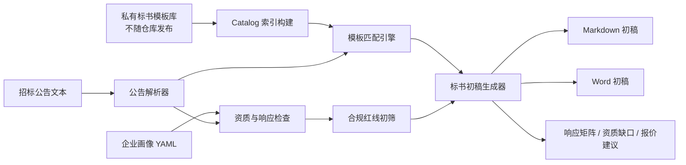
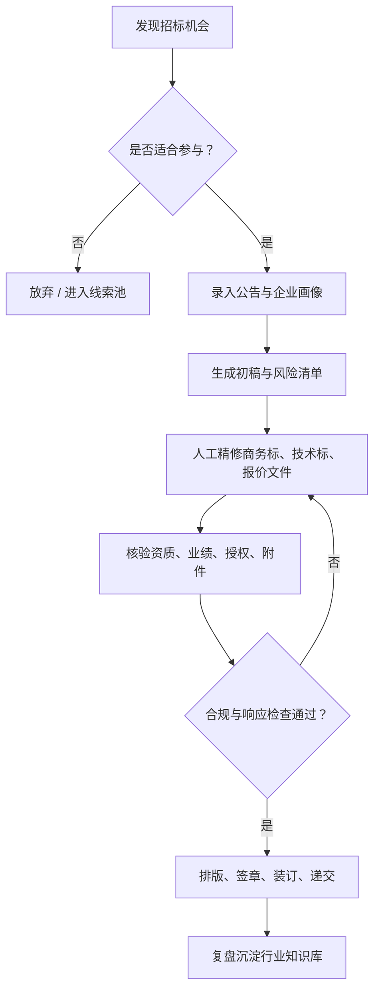

# Tender Bid Assistant

Tender Bid Assistant 是一个面向中小企业、投标服务团队和招投标咨询场景的开源投标助手，用于把招标公告解析、标书模板匹配、标书初稿生成、资质缺口检查、逐条响应矩阵和合规风险初筛整合成一条可复用的工作流。

如果你正在寻找“招投标助手”“投标助手”“标书生成工具”“投标文件初稿生成器”“招标公告解析工具”“标书模板知识库”或“AI 投标助手”，Tender Bid Assistant 的目标就是帮助团队更快完成从“看到机会”到“形成可精修初稿”的第一步。

[](#)
[](#license)
[](#安装依赖)

[快速开始](#快速开始) · [能力一览](#能力一览) · [适用关键词](#适用关键词) · [架构图](#架构图) · [FAQ](#faq) · [公开仓库边界](#公开仓库边界)

> 个人学习与非商业使用免费。商业使用请联系作者授权。

## 核心能力

- 招标公告要点提取：项目名称、采购人、代理机构、预算、截止时间、评审方式等。
- 标书模板匹配：基于本地标书库索引，按行业、章节标题和公告关键词推荐相关模板。
- 标书初稿生成：输出 Markdown 和 Word 版初稿，便于后续人工精修。
- 逐条响应矩阵：按资格条件、价格评分、技术评分、服务承诺等维度生成响应清单。
- 资质缺口初筛：根据公告关键词和企业画像提示待补材料。
- 合规红线检查：识别陪标、串标、虚假资质、借用资质等高风险表述。
- 商业交付清单：沉淀售前判断、初稿交付、人工复核与最终投递前检查流程。

## 适用关键词

| 类别 | 关键词 |
| --- | --- |
| 中文核心词 | 招投标助手、投标助手、标书生成工具、标书初稿、招标公告解析、投标文件生成、标书模板库 |
| AI 场景词 | AI 投标助手、AI 标书生成、招投标智能体、投标智能体、智能标书生成 |
| 业务场景词 | 政府采购投标、软件项目投标、信息化项目投标、IT 运维投标、系统集成投标 |
| 交付流程词 | 资质缺口检查、逐条响应矩阵、商务标、技术标、报价文件、投标合规检查 |
| English keywords | tender assistant, bid assistant, bid proposal generator, tender document generator, procurement proposal tool |

## 能力一览

| 工作目标 | 主要入口 | 常见产出 |
| --- | --- | --- |
| 判断项目是否值得参与 | `gen_bid.py --tender 公告.txt` | 公告摘要、预算、截止时间、评审方式、风险提示 |
| 匹配可参考的标书结构 | `build_catalog.py` + `gen_bid.py --top 5` | 推荐模板清单、章节大纲、相关度排序 |
| 生成标书初稿 | `gen_bid.py --docx` | `标书初稿.md`、`标书初稿.docx` |
| 检查资质和材料缺口 | `--company 企业画像.yaml` | 营业执照、授权书、业绩、社保纳税、专项资质缺口 |
| 做逐条响应与交付复核 | 生成报告中的响应矩阵 | 资格条件、技术评分、价格评分、服务承诺响应清单 |
| 标准化投标交付 | 接入本地私有模板库和客户资料 | 售前诊断、初稿生成、人工精修、交付复核流程 |

## 适用场景

- 中小软件公司参与政府采购、国企采购、高校/医院信息化项目。
- 投标服务团队快速生成商务标、技术标、报价文件的初稿框架。
- 招投标线索监控系统后接“公告解析 → 初稿生成 → 人工精修”的自动化流程。
- 企业内部建立可复用的行业标书知识库和响应素材库。

## 解决什么问题

| 真实处境 | 你会得到 |
| --- | --- |
| 每天看到很多招标公告，不知道哪个值得跟 | 项目摘要、适配度判断、资质缺口和时间风险 |
| 客户要得急，但标书结构还没搭起来 | 可继续精修的商务标、技术标、报价文件初稿 |
| 团队经验散落在历史标书、群聊和个人电脑里 | 可沉淀的本地模板索引和行业知识库 |
| 投标材料容易漏附件、漏响应评分点 | 逐条响应矩阵和最终交付复核清单 |
| 想把投标服务做成标准化业务 | 售前诊断、初稿生成、人工精修、交付复核四阶段流程 |

## 与通用大模型的区别

| 对比项 | 通用大模型直接写标书 | Tender Bid Assistant |
| --- | --- | --- |
| 输入结构 | 依赖人工提示词 | 招标公告 + 企业画像 + 本地模板索引 |
| 模板来源 | 容易泛化 | 基于用户自己的私有标书库匹配 |
| 风险控制 | 需要人工额外提醒 | 内置合规红线和资质缺口初筛 |
| 交付格式 | 通常是普通文本 | Markdown + Word 初稿 |
| 团队沉淀 | 难以复用 | 支持 catalog 和 knowledge 知识库 |
| 商业边界 | 容易混入客户资料 | 明确私有素材不公开 |

## 工作流

```text
招标公告文本
    ↓
公告要点抽取与合规初筛
    ↓
本地标书库 catalog 匹配 Top N 模板
    ↓
生成标书大纲、响应矩阵、资质缺口、报价建议
    ↓
输出 Markdown / Word 初稿
    ↓
人工补齐真实资质、业绩、报价、授权与附件
```

## 架构图



## 交付流程图



## 目录结构

```text
tender-bid-assistant/
├── scripts/
│   ├── build_catalog.py      # 构建本地标书库索引
│   ├── gen_bid.py            # 根据公告生成标书初稿
│   ├── parse_bid_doc.py      # 解析 docx/pdf 标书文档
│   └── build_kb.py           # 构建行业知识库 YAML
├── templates/
│   └── company_profile.yaml  # 企业画像模板
├── knowledge/                # 可选行业知识库示例
├── _selftest/                # 最小自测样例
├── SKILL.md                  # Codex skill 说明
└── README.md
```

## 安装依赖

建议使用 Python 3.9+。

```powershell
pip install python-docx pdfplumber pyyaml
```

如果需要解析旧版 `.doc` 文件，还需要安装 `antiword`，并确保命令行可直接调用。

## 快速开始

1. 准备企业画像。

复制 `templates/company_profile.yaml`，填写企业名称、资质、类似业绩、团队配置、服务区域和报价策略。

2. 构建本地模板索引。

```powershell
python scripts/build_catalog.py `
  --root "D:\your-private-bid-docs" `
  --out-dir data
```

3. 根据公告生成标书初稿。

```powershell
python scripts/gen_bid.py `
  --tender "公告.txt" `
  --company "templates/company_profile.yaml" `
  --out "output\某项目" `
  --top 5 `
  --docx
```

生成结果：

```text
output/某项目/
├── 标书初稿.md
└── 标书初稿.docx
```

4. 运行自测。

```powershell
python _selftest/run_all.py
```

## 输出内容

生成的初稿通常包含：

- 招标要点摘要
- 合规红线与投标风险初筛
- 推荐模板清单
- 标书大纲初稿
- 逐条响应矩阵
- 资质缺口清单
- 报价建议
- 商业交付清单
- 最终投递前风险提示

## FAQ

### Tender Bid Assistant 是什么？

Tender Bid Assistant 是一个招投标辅助工具，用于解析招标公告、匹配本地标书模板、生成标书初稿、检查资质缺口，并输出逐条响应矩阵和投标风险提示。

### Tender Bid Assistant 适合谁使用？

它适合中小软件公司、投标服务团队、招投标咨询团队、系统集成公司、IT 运维服务商，以及需要标准化处理投标材料的企业团队。

### Tender Bid Assistant 能自动生成正式投标文件吗？

不能直接替代人工最终投递。它生成的是可精修的标书初稿和检查清单，正式投标文件仍需要人工核验资质、业绩、报价、签章、附件和采购文件要求。

### Tender Bid Assistant 会公开我的标书模板吗？

不会。公开仓库只包含脚本、空模板和最小自测样例。真实标书模板、客户资料、项目资料和生成结果应保存在本地私有目录，不应上传到公开仓库。

### Tender Bid Assistant 和普通 AI 写作工具有什么不同？

普通 AI 写作工具主要依赖提示词生成文本。Tender Bid Assistant 更强调招投标工作流：公告解析、模板匹配、企业画像、响应矩阵、资质缺口、合规红线和 Word 初稿输出。

### Tender Bid Assistant 可以商用吗？

个人学习、研究和非商业项目可以使用。商业用途需要单独授权，请联系作者。

## 公开仓库边界

为了保护商业资产和客户隐私，公开仓库不应包含以下内容：

- 购买、收集或客户提供的原始标书模板。
- `data/catalog.json`、`data/catalog.jsonl`、`.ckpt.json` 等由私有模板库生成的索引。
- 客户营业执照、授权书、合同、发票、社保、纳税、证书、报价明细。
- 真实招标项目的未公开沟通记录、内部评审意见或交付文档。
- `.env`、密钥、Token、邮箱 SMTP 密码、服务器信息等敏感配置。

推荐公开代码、脚本、空模板、最小自测样例和使用说明；私有模板库与客户资料由使用者在本地自行配置。

## 合规声明

本项目用于提升招投标咨询、文档整理和投标材料初稿编写效率。使用者必须遵守招投标相关法律法规和采购文件要求。

严禁将本工具用于：

- 陪标、串标、围标、控标等违法违规行为。
- 虚构资质、业绩、授权、人员证书、社保纳税证明或合同发票。
- 未经授权复制、转卖、公开第三方标书模板或客户资料。
- 自动生成后未经人工审核直接投递正式投标文件。

所有正式投递文件必须由具备业务判断能力的人员逐项核验。

## 标准化交付

- 售前诊断：判断项目适配度、资质缺口、时间风险和报价空间。
- 初稿生成：形成商务标、技术标、报价文件的基础结构。
- 人工精修：补齐真实材料、案例、承诺、排版和附件。
- 交付复核：检查评分点响应、格式装订、签章盖章、截止时间和合规风险。

工具负责提高初稿生产效率，最终交付质量仍取决于真实材料、人工审核和项目经验。

## License

本项目采用 [CC BY-NC 4.0](LICENSE) 许可证。

个人使用、学习、研究与非商业项目可以直接使用。

公开发布衍生作品时，请注明来源。

商业用途需要单独授权，请联系作者。

## 交流与支持

- 联系作者：1690069811
- 网站：[www.gzarzx.com](https://www.gzarzx.com)

加入招投标智能体交流群：


